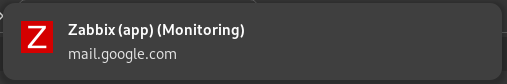
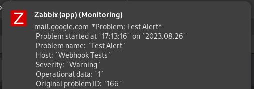
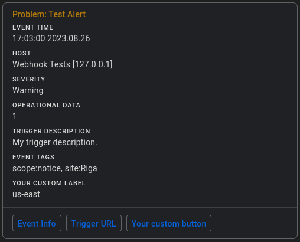
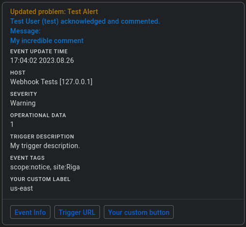
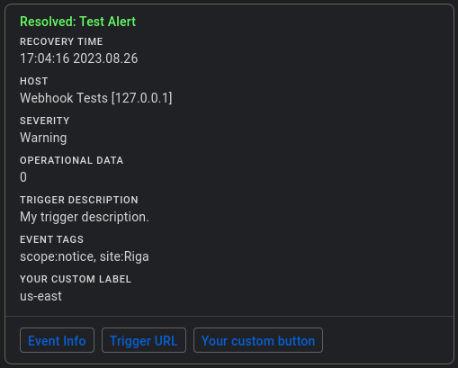
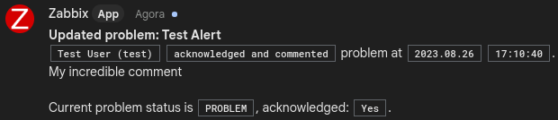
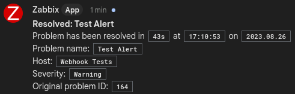
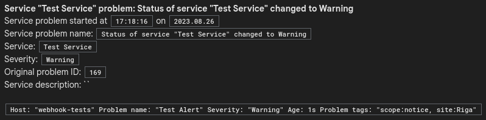
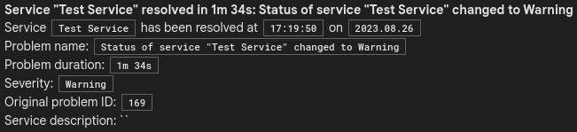
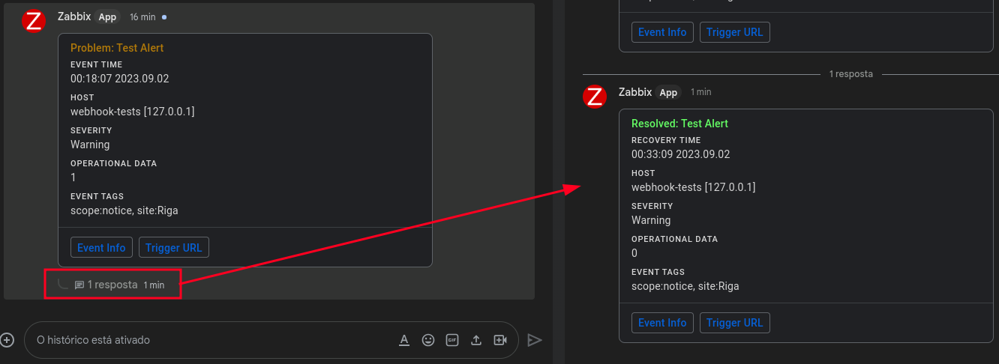

# Zabbix - Google Chat Webhook

Receive notifications from your Zabbix in a Google Chat space (only available for [Google Workspace](https://workspace.google.com/products/chat/) subscriptions).

## Zabbix version

Choose according to the Zabbix version you use, but it is recommended that you read the information in the next sections of this README before proceeding.

- [5.0](v5.0/)
- [6.0](v6.0/)
- [6.4](v6.4/)
- [7.0](v7.0/)

## Group Messages by thread

By default notification messages sent to Google Chat are grouped (same thread) by Zabbix event ID.

If you prefer that each new notification message appears in Google Chat as a new message, change the value of the *group_messages_by_thread* parameter to **false** (details in each version's readme).

## Support Single or Multiple Space

Google Chat webhook supports integration with a single space or multiple spaces, depending on the configuration performed (details in each version's readme).

### Multiple Spaces - Security Note

When configuring the Google Chat webhook in Zabbix with support for multiple spaces, the **incoming webhook URL** may be visible to some users in the details of problems in Zabbix frontend ([see this comment](https://github.com/thiagomdiniz/zabbix-google-chat-webhook/issues/1#issuecomment-1703705966)).

## Pop-Up Notifications

By default trigger notifications are sent using [Google Chat cards](https://developers.google.com/chat/api/guides/message-formats/cards).
Since a card is not plain text, the notification popup is unable to display notification details:

If it is important to you that the notification pop-up display details of the received message, you need to change the default behavior to always send notifications using plain text.
To do so, change the value of the *"use_default_message"* parameter to **true** (details in each version's readme):

## Support notes

To test the integration with Google Chat through webhooks, you must have a Google Workspace subscription.
Since I don't have a Google Workspace subscription, I'll probably need your support if you open an issue (to help validate a possible solution to the issue).

## Some screenshots

### Problem (card)

### Problem updated (card)

### Problem resolved (card)

### Problem (text)

### Problem updated (text)

### Problem resolved (text)

### Service problem

### Service resolved

### Messages grouped on the same thread

