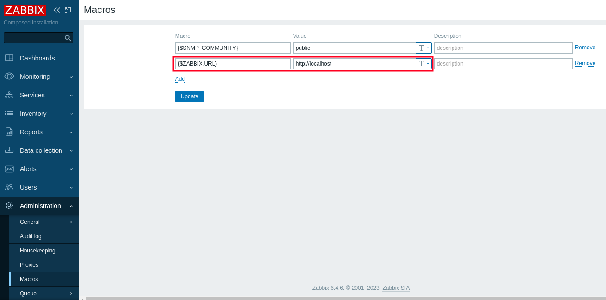
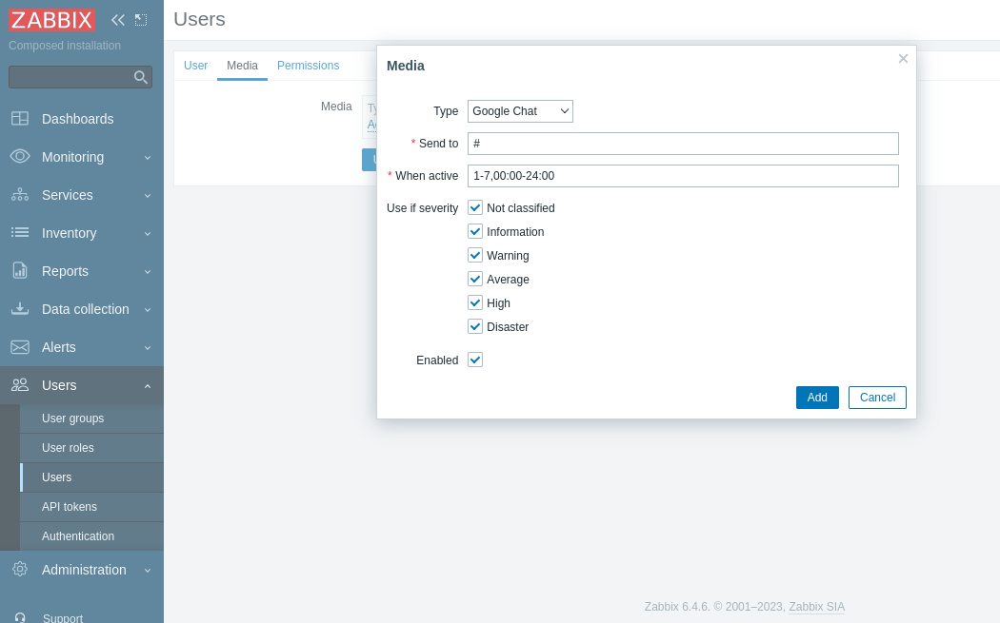

# Google Chat webhook

This guide describes how to integrate Zabbix 6.4 with Google Chat using the Zabbix webhook feature. This guide will provide instructions on setting up a media type, a user and an action in Zabbix. 
This integration is supported only for **Chat** as part of Google Workspace. Note, that **Chat** free plan does not support [incoming webhook](https://developers.google.com/chat/how-tos/webhooks#step_1_register_the_incoming_webhook) feature.

## Setting up webhook in Google Chat
Google Chat webhook only supports integrating with a single space.

Because The icon for manage webhooks is only available from a web browser, webhooks must be set up from the Chat web app. Webhooks are not configurable from the Chat mobile app.

First, you need to get a webhook URL for the space:

- Create **Incoming webhook** for your space.
(See **Chat** [documentation](https://developers.google.com/chat/how-tos/webhooks#step_1_register_the_incoming_webhook) for the step-by-step instructions).

## Setting up webhook in Zabbix 
1\. In the Zabbix web interface go to Administration → Macros. Setup the global macro "{$ZABBIX.URL}" which will contain the URL to the Zabbix frontend. 
 The URL should be either an IP address, a fully qualified domain name or localhost. Specifying a protocol is mandatory, whereas port is optional.
Good examples: 
http://zabbix.com 
https://zabbix.lan/ 
http://server.zabbix.lan/ 
http://localhost 
http://127.0.0.1:8080 

Bad examples: 
zabbix.com 
http://zabbix/ 

2\. In the *Alerts > Media types* section, import the [media_google_chat.yaml](media_google_chat.yaml)

3\. Open the newly added **Google Chat** media type and replace placeholder *&lt;PLACE WEBHOOK URL HERE&gt;* with the **incoming webhook URL**, created during the webhook setup in Google Chat.

4\. You can also choose between two notification formats. Set *"use_default_message"* parameter:
- **false** (default)
    - Use preformatted message with predefined set of fields for trigger-based notifications. 
    In internal, autoregistration, discovery and service notifications *{ALERT.MESSAGE}* as a body of the message will be used.
    In this case you can customize the message template for trigger-based notifications by adding additional fields and buttons with URLs.
        - To add an additional field to message card, put a parameter with prefix **label_** and field name. For example, *"label_Data center"* as key and *{EVENT.TAGS.dc}* as value.
        - To create a new button with a link to an external resource, add a parameter with prefix **openUri_** and button name. The value should be a valid URL. For example, *"openUri_Link to Zabbix.com"* as key and *https://www.zabbix.com/* as value. 

- **true**
    - Use {ALERT.MESSAGE} as a body of the message in all types of notifications.

5\. To receive Zabbix notifications in Google Chat, you need to create a **Zabbix user** and add **Media** with the **Google Chat media type**. 
In the *Users → Users section*, click *Create user* button in the top right corner. In the *User* tab, fill in all required fields (marked with red asterisks). In the *Media* tab, add a new media and select **"Google Chat"** type from the drop-down list. Though a "*Send to*" field is not used in Google Chat media, it cannot be empty. To comply with the frontend requirements, you can put any symbol there. 
Make sure this user has access to all hosts for which you would like problem notifications to be sent to Google Chat. 

6\. Great! You can now start receiving alerts!

For more information see [Zabbix](https://www.zabbix.com/documentation/6.4/manual/config/notifications) and [Google Chat webhook](https://developers.google.com/chat/how-tos/webhooks) documentations.

## Supported Versions
Zabbix 6.4
